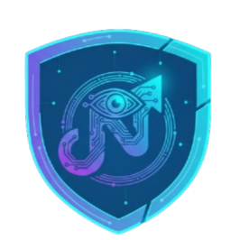

# NexAttend - AI-Based Multi-Face Recognition & Classroom Management System

> **Automating attendance, ensuring security, and boosting engagement in modern education.**



## 📋 Abstract
NexAttend is a cutting-edge **AI-based multi-face recognition attendance and classroom management system** designed to modernize educational institutions. Unlike traditional manual roll-call or single-student biometric scans, NexAttend uses **MTCNN** and **DeepFace** to detect and identify multiple students simultaneously from a single webcam frame.

The system integrates real-time attendance tracking with anomaly detection (anti-spoofing), analytics dashboards, and gamification elements to create a secure and engaging classroom environment.

---

## 🚀 Key Features

* **🤖 Multi-Face Recognition:** Detects and identifies multiple students in a single frame using **MTCNN** (detection) and **DeepFace** (recognition).
* **🛡️ Anomaly Detection:** Automatically flags unknown faces, low-confidence matches, and potential spoofing attempts.
* **📊 Dual Dashboards:**
    * **Teacher Dashboard:** Start sessions, view live analytics, and manage class records.
    * **Student Dashboard:** View personal attendance history, engagement scores, and notifications.
* **📈 Smart Analytics:** Visualizes attendance trends and participation data using interactive charts.
* **📧 Automated Notifications:** Sends email alerts to students regarding their attendance status (Present/Absent/Late).
* **🏆 Gamification:** Precise motivational scoring (e.g., attendance points) to encourage consistent participation.

---

## 🛠️ Technology Stack

The project follows a **Microservices / Layered Architecture**.

| Component | Technology | Description |
| :--- | :--- | :--- |
| **Frontend** | React.js, Vite, TailwindCSS | Responsive Web Interface |
| **Backend** | Node.js, Express.js | API Gateway & Business Logic |
| **AI Service** | Python, Flask, OpenCV | Face Recognition Engine (MTCNN + DeepFace) |
| **Database** | MongoDB Atlas | Cloud Data Storage for users & logs |
| **Containerization** | Docker | Service orchestration (Recommended) |

---

## � Project Structure

```
NexAttend-webapp/
├── backend/                 # FastAPI Backend
│   ├── app/
│   │   ├── api/             # API Routes & Endpoints
│   │   ├── core/            # Config & Security
│   │   ├── models/          # Database Models
│   │   ├── services/        # Business Logic & AI Services
│   │   └── main.py          # Application Entry Point
│   ├── tests/               # Backend Tests
│   └── requirements.txt     # Python Dependencies
│
├── web/                     # React Frontend
│   ├── src/
│   │   ├── components/      # Reusable UI Components
│   │   ├── contexts/        # React Context (Auth, Theme)
│   │   ├── pages/           # Application Pages
│   │   ├── services/        # API Integration
│   │   └── App.tsx          # Main Component
│   ├── public/              # Static Assets
│   └── package.json         # Node Dependencies
│
└── README.md                # Project Documentation
```

## 🤝 Contributors

- **Kumuthu** - AI Core & Backend
- **Thiviru** - Frontend Architecture & UI
- **Yasitha** - UI Components & features
- **Sudam** - Backend Logic & Database
- **Thisandu** - Backend AI Integration
- **Viraj** - Testing & Quality Assurance
