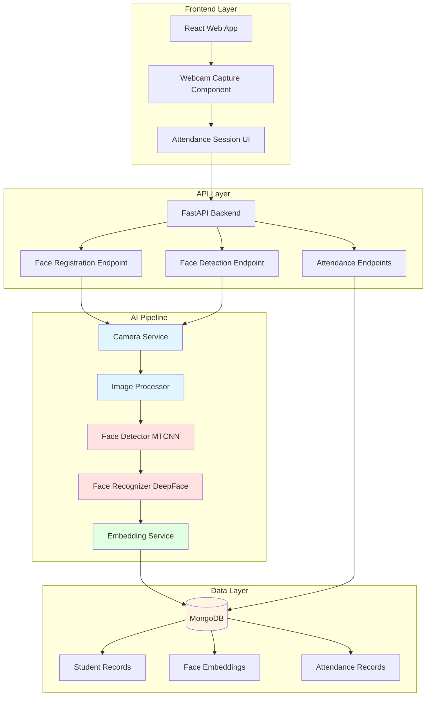
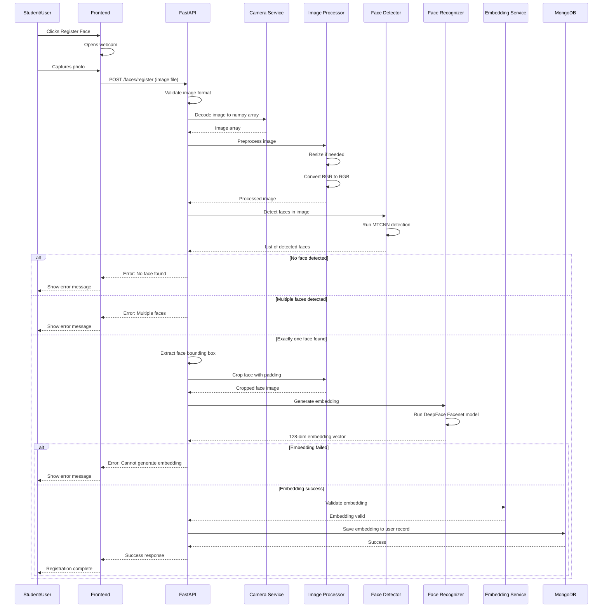
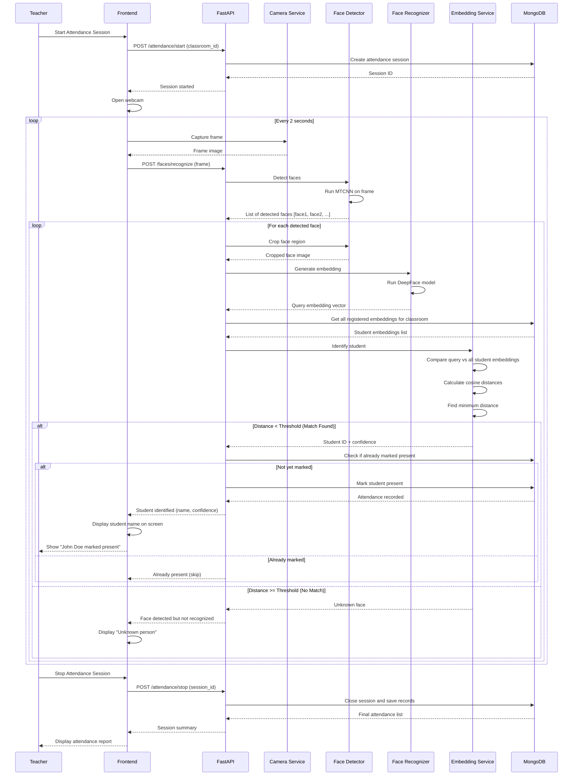
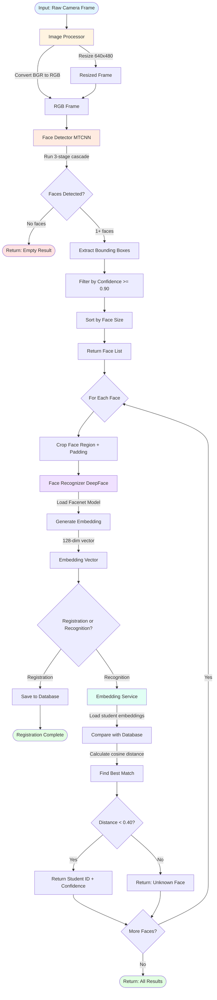

# AI Pipeline Diagrams

This document contains all visual diagrams for the NexAttend AI pipeline. These diagrams illustrate the system architecture, data flows, and component interactions.

---

## 1. System Architecture

High-level overview of the complete system showing all layers and their interactions.

**Description:**
- Frontend handles user interaction and webcam capture
- API layer provides RESTful endpoints
- AI pipeline processes images through multiple stages
- Data layer stores student info, embeddings, and attendance records

---

## 2. Face Registration Flow

Sequence diagram showing the step-by-step process of registering a student's face.

**Description:**
- User captures or uploads photo
- System validates exactly one face present
- Face embedding generated and stored
- Error handling for edge cases

---

## 3. Face Recognition and Attendance Marking Flow

Sequence diagram showing real-time face recognition during attendance sessions.

**Description:**
- Teacher starts attendance session
- System continuously captures and processes frames
- Multiple faces processed simultaneously
- Duplicates prevented by checking existing records
- Session ends with complete attendance report

---

## 4. Component Interaction Flow

Flowchart showing detailed logic flow through AI components.

**Description:**
- Shows decision branches and loops
- Handles both registration and recognition modes
- Processes multiple faces in sequence
- Final results aggregated and returned

---

## 5. Model Architecture and Data Flow

Detailed view of neural network layers and data transformations.

```mermaid
graph LR
    subgraph "Input Layer"
        A[Raw Image<br/>640x480x3 BGR]
    end
    
    subgraph "Preprocessing"
        B[Convert to RGB]
        C[Resize/Normalize]
    end
    
    subgraph "MTCNN Detection"
        D1[Stage 1: P-Net<br/>Proposal Network]
        D2[Stage 2: R-Net<br/>Refine Network]
        D3[Stage 3: O-Net<br/>Output Network]
    end
    
    subgraph "Face Extraction"
        E[Bounding Box<br/>x, y, w, h]
        F[Crop + Padding]
        G[Face Image<br/>160x160x3]
    end
    
    subgraph "DeepFace Facenet"
        H[Conv Layers]
        I[Inception Blocks]
        J[Fully Connected]
        K[L2 Normalization]
    end
    
    subgraph "Output Layer"
        L[Embedding Vector<br/>128 dimensions]
    end
    
    subgraph "Comparison"
        M[Database<br/>Embeddings]
        N[Cosine Similarity]
        O{Distance < 0.40?}
    end
    
    subgraph "Result"
        P[Match: Student ID]
        Q[No Match: Unknown]
    end
    
    A --> B
    B --> C
    C --> D1
    D1 --> D2
    D2 --> D3
    D3 --> E
    E --> F
    F --> G
    G --> H
    H --> I
    I --> J
    J --> K
    K --> L
    L --> N
    M --> N
    N --> O
    O -->|Yes| P
    O -->|No| Q
    
    style A fill:#e1f5ff
    style D1 fill:#ffe1e1
    style D2 fill:#ffe1e1
    style D3 fill:#ffe1e1
    style H fill:#f0e1ff
    style I fill:#f0e1ff
    style J fill:#f0e1ff
    style L fill:#e1ffe1
    style P fill:#d4edda
    style Q fill:#f8d7da
```

**Description:**
- MTCNN uses 3-stage cascade for face detection
- DeepFace Facenet generates embeddings through deep CNN
- Cosine similarity used for comparing embeddings
- Threshold determines match or no match result

---

## Diagram Usage

These diagrams can be:
- Viewed directly in Markdown viewers that support Mermaid
- Rendered using Mermaid Live Editor (https://mermaid.live)
- Included in presentations and documentation
- Used for team onboarding and training

## Tools for Viewing

**Online:**
- Mermaid Live Editor: https://mermaid.live
- GitHub (automatic rendering)
- VS Code with Mermaid extension

**Offline:**
- VS Code with Mermaid Preview extension
- Typora (Markdown editor with Mermaid support)
- Export as PNG/SVG using Mermaid CLI

---

## Updating Diagrams

To update these diagrams:
1. Edit the Mermaid code blocks
2. Test in Mermaid Live Editor
3. Verify rendering in your viewer
4. Commit changes to repository

---

Created by: Viraj Jayasiri  
Date: Week 2 Day 10  
Branch: docs/ai-pipeline
