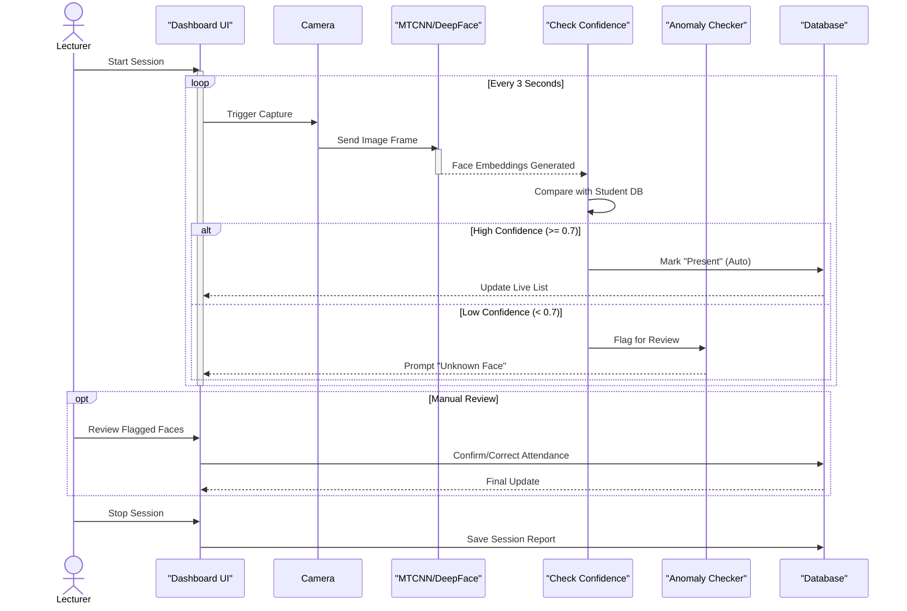

 Attendance Marking Flow Documentation

 Overview
This document outlines the technical flow for the Real-Time Attendance Marking feature, based on the system architecture designed by the lead engineer.

 Architecture Diagram (Sequence)



 detailed Steps

1. Session Initialization
   Trigger: Teacher clicks "Start Attendance" on the Dashboard.
   Action: Frontend initializes the webcam and starts a loop (e.g., `setInterval` every 3s).
   Context: The `classroom_id` and `session_id` are stored in the state.

2. Capture & Processing
   Input: A single frame (JPEG/PNG) from the video feed.
   API Call: `POST /api/v1/attendance/mark`
       Body: `upload_file (image)`
       Params: `classroom_id`, `min_confidence=0.6`
   AI Service: 
    1.  Face Detection: MTCNN scans internal image.
    2.  Embedding: Facenet converts faces to vectors.
    3.  Vector Search: Compares vectors against students enrolled in `classroom_id`.

3. Decision Logic (Confidence)
The system uses a similarity threshold (e.g., cosine distance < 0.4 equals ~70% confidence).

   Match Found: 
       If best match is strong -> Insert into `attendance` collection with status `Present`.
       Return: `{ "status": "marked", "student_name": "Kumuthu" }`
   Ambiguous:
       If best match is weak -> Insert into `attendance_anomalies` or return warning.
       Return: `{ "status": "flagged", "possible_matches": [...] }`

 4. Database Schema

Attendance Record:
```json
{
  "_id": "ObjectId",
  "session_id": "ObjectId",
  "student_id": "ObjectId",
  "timestamp": "2024-02-10T10:30:00Z",
  "status": "Present",
  "method": "AI_AUTO",
  "face_confidence": 0.85
}
```

Next Steps for Developers

1.  Backend: Implement the `POST /attendance/mark` endpoint to handle the logic above.
2.  Frontend: Build the loop to capture frames and handle the "Flagged" response.
